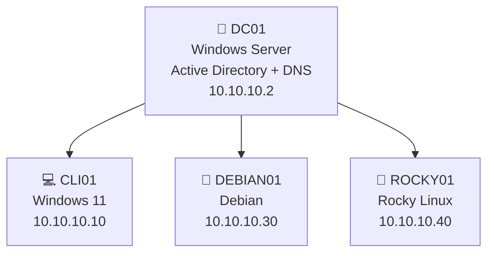
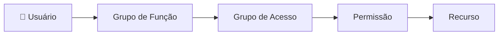
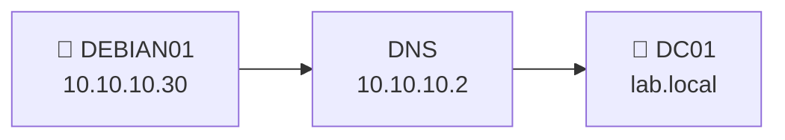
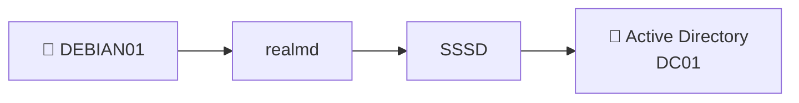
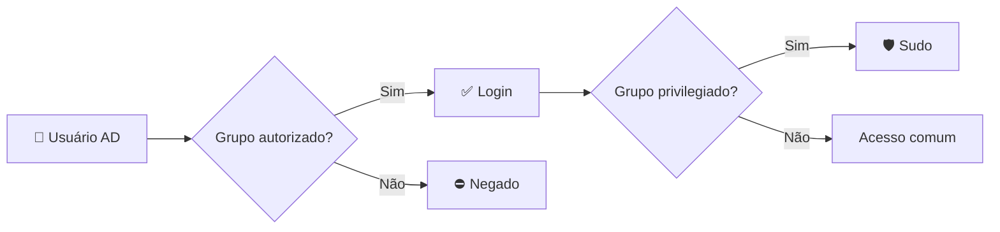
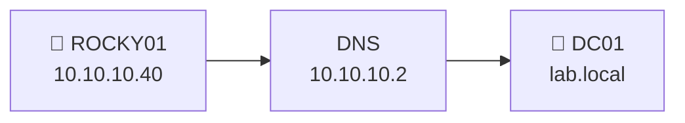
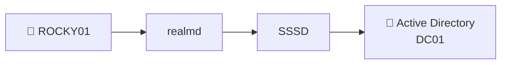

# 🔐 Identity & Access Management Lab

> **Active Directory · Windows · Debian · Rocky Linux · SSSD · Kerberos · GPO**

Laboratório prático de **Gestão de Identidades e Acessos (IAM)** em ambiente multiplataforma, utilizando o **Active Directory** como serviço central de identidade e grupos como principal mecanismo de autorização.

O ambiente demonstra **autenticação centralizada, controle de acesso baseado em grupos, separação entre usuários comuns e privilegiados, grupos aninhados, integração Windows/Linux, concessão e revogação de acessos e Least Privilege**.

---

## 🧭 Visão Geral

| Host | Sistema | Papel | IP |
| :--- | :--- | :--- | :--- |
| `DC01` | Windows Server | Domain Controller / AD / DNS | `10.10.10.2` |
| `CLI01` | Windows 11 Pro | Estação cliente | `10.10.10.10` |
| `DEBIAN01` | Debian | Servidor Linux | `10.10.10.30` |
| `ROCKY01` | Rocky Linux 9.8 | Servidor Linux | `10.10.10.40` |

**Domínio:** `lab.local` · **Rede:** `10.10.10.0/24` · **DNS:** `10.10.10.2`

### Arquitetura



O `DC01` centraliza as identidades e os serviços do domínio. O `CLI01` representa uma estação corporativa Windows, enquanto `DEBIAN01` e `ROCKY01` representam servidores Linux com acesso controlado por identidades e grupos.

---

# 🏢 DC01 — Windows Server

> **Domain Controller · Active Directory · DNS · Kerberos · GPO**

O `DC01` atua como núcleo de identidade do laboratório, centralizando **usuários, grupos, autenticação, políticas e serviços de domínio**.

**IP:** `10.10.10.2/24` · **Domínio:** `lab.local` · **DNS:** `10.10.10.2`

---

## Active Directory e DNS

O servidor foi promovido a **Domain Controller** da floresta `lab.local` com os serviços **Active Directory Domain Services (AD DS)** e **DNS**.

```text
DC01
 │
 ├── Active Directory
 ├── DNS
 ├── Kerberos
 ├── Usuários
 ├── Grupos
 ├── OUs
 └── GPOs
```

O DNS interno permite que os demais hosts localizem o domínio e seus serviços.

A sincronização de horário foi configurada entre os sistemas do ambiente para manter consistência temporal durante a autenticação.

<details>
<summary><b>⚙️ Configuração principal</b></summary>

<br>

```text
Hostname: DC01
IPv4:    10.10.10.2/24
Domínio: lab.local
DNS:     10.10.10.2
```

**Funções**

- Active Directory Domain Services
- DNS Server

</details>

---

## OUs, usuários e grupos

Os objetos do Active Directory foram organizados através de **Organizational Units (OUs)** e grupos de segurança.


A atribuição de permissões através de grupos reduz concessões individuais e centraliza a administração dos acessos.

<details>
<summary><b>👥 Ver estrutura de identidades e grupos</b></summary>

<br>

Os usuários utilizados no laboratório foram associados aos respectivos grupos de acordo com o perfil de acesso.

```text
Usuário comum
    │
    └── Grupo comum

Usuário privilegiado
    │
    └── Grupo administrativo
```

Os nomes dos objetos correspondem à estrutura efetivamente criada no Active Directory.

</details>

---

## Grupos aninhados

Foi configurado um cenário de **Nested Groups**, separando o grupo relacionado à função do usuário do grupo responsável pela concessão do acesso.



Esse modelo permite que o acesso seja concedido indiretamente através da associação entre grupos.

---

## Group Policy — GPO

As políticas do ambiente Windows foram centralizadas através de **Group Policy Objects**.

A GPO de segurança foi aplicada à OU correspondente e utilizada para configurar controles como:

`Senha` · `Bloqueio de conta` · `Bloqueio por inatividade`

<details>
<summary><b>⚙️ Aplicação e validação da GPO</b></summary>

<br>

```powershell
gpupdate /force
gpresult /r
gpresult /h C:\gpresult.html /f
```

**Função dos comandos**

`gpupdate /force` → força a atualização das políticas.

`gpresult /r` → exibe as políticas aplicadas.

`gpresult /h` → gera um relatório detalhado das políticas.

</details>

---

# 💻 CLI01 — Windows 11

> **Windows Client · Domain Member · GPO**

O `CLI01` representa uma **estação corporativa Windows** utilizada para validar autenticação no domínio e aplicação das políticas centralizadas.

**IP:** `10.10.10.10/24` · **DNS:** `10.10.10.2` · **Domínio:** `lab.local`

```text
CLI01
  │
  ├── DNS ──────────► DC01
  ├── Domínio ──────► lab.local
  ├── Autenticação ─► Active Directory
  └── Políticas ────► GPO
```

---

## Ingresso no domínio

O DNS da estação foi configurado para apontar para o `DC01`, permitindo a localização do domínio `lab.local`.

Após o ingresso, o computador passou a ser reconhecido como membro do domínio.

<details>
<summary><b>🔎 Validação da estação</b></summary>

<br>

```powershell
whoami
ipconfig /all
```

Esses comandos permitem validar a identidade utilizada e as configurações de rede/DNS da estação.

</details>

---

## Aplicação das políticas

As políticas configuradas no Active Directory foram aplicadas e validadas no `CLI01`.

<details>
<summary><b>🛡️ Validação das GPOs</b></summary>

<br>

```powershell
gpupdate /force
gpresult /r
```

O resultado confirma as políticas recebidas pela estação através do domínio.

</details>

---

# 🐧 DEBIAN01 — Debian

> **Linux Server · Local Access · Active Directory · SSSD**

O `DEBIAN01` representa um servidor Linux corporativo integrado ao domínio `lab.local`.

O servidor utiliza **grupos locais e grupos do Active Directory** para diferenciar usuários comuns, usuários autorizados e usuários privilegiados.

**IP:** `10.10.10.30/24` · **DNS:** `10.10.10.2` · **Domínio:** `lab.local`

---

## Rede e comunicação com o DC01



O servidor utiliza o `DC01` como DNS interno e consegue localizar o domínio.

<details>
<summary><b>⚙️ Validação de rede e DNS</b></summary>

<br>

```bash
ip -4 addr
ip route
ping -c 4 10.10.10.2
nslookup lab.local 10.10.10.2
```

</details>

---

## Usuários e grupos locais

O acesso local foi separado entre um perfil administrativo e um perfil comum.

```text
linuxadmin ─────► linux-admins ─────► SUDO

linuxuser ──────► linux-users ──────► acesso padrão
```

<details>
<summary><b>👥 Criação e validação das identidades locais</b></summary>

<br>

**Grupos**

```bash
sudo groupadd linux-admins
sudo groupadd linux-users
```

**Usuários**

```bash
sudo useradd -m -G linux-admins linuxadmin
sudo useradd -m -G linux-users linuxuser
```

**Validação**

```bash
id linuxadmin
id linuxuser
```

</details>

---

## Sudo baseado em grupo local

O privilégio administrativo foi atribuído ao grupo `linux-admins`, e não diretamente ao usuário.

```text
%linux-admins ALL=(ALL:ALL) ALL
```

| Perfil | Grupo | Sudo |
| :--- | :--- | :---: |
| Administrativo | `linux-admins` | ✅ |
| Comum | `linux-users` | ❌ |

<details>
<summary><b>🛡️ Validação do privilégio</b></summary>

<br>

O teste foi realizado com os dois perfis para confirmar:

```text
linuxadmin → operação administrativa permitida
linuxuser  → operação administrativa negada
```

</details>

---

## Integração com o Active Directory

A integração do `DEBIAN01` com o `DC01` foi realizada utilizando **realmd, SSSD e Kerberos**.



<details>
<summary><b>⚙️ Ingresso no domínio</b></summary>

<br>

**Descoberta do domínio**

```bash
realm discover lab.local
```

**Ingresso**

```bash
sudo realm join lab.local -U Administrator
```

**Validação**

```bash
realm list
systemctl status sssd
```

</details>

---

## Identidades e grupos do AD

Após a integração, o servidor passou a reconhecer identidades provenientes do Active Directory.

<details>
<summary><b>🔎 Validação das identidades do domínio</b></summary>

<br>

```bash
id usuario@lab.local
```

O retorno apresenta a identidade e os grupos do Active Directory reconhecidos pelo Linux através do SSSD.

</details>

---

## Controle de acesso através do AD

O acesso ao `DEBIAN01` foi condicionado à associação do usuário aos grupos autorizados no Active Directory.



Assim, a identidade pode existir e autenticar no domínio sem necessariamente possuir autorização para acessar o servidor.

---

# 🐧 ROCKY01 — Rocky Linux

> **Linux Server · Local Access · Active Directory · SSSD**

O `ROCKY01` representa o segundo servidor Linux do ambiente, utilizado para validar o mesmo modelo de Gestão de Acessos em uma distribuição diferente.

**IP:** `10.10.10.40/24` · **DNS:** `10.10.10.2` · **Domínio:** `lab.local`

---

## Rede e comunicação com o DC01



A interface interna foi configurada com:

```text
IP:     10.10.10.40/24
DNS:    10.10.10.2
Search: lab.local
```

<details>
<summary><b>⚙️ Validação de rede e DNS</b></summary>

<br>

**Comunicação com o DC**

```bash
ping -c 4 10.10.10.2
```

Resultado:

```text
4 packets transmitted
4 received
0% packet loss
```

**Resolução DNS**

```bash
nslookup lab.local 10.10.10.2
```

Resultado:

```text
Server:  10.10.10.2
Address: 10.10.10.2#53

Name:    lab.local
Address: 10.10.10.2
```

</details>

---

## Usuários e grupos locais

```text
linuxadmin ─────► linux-admins ─────► SUDO

linuxuser ──────► linux-users ──────► acesso padrão
```

<details>
<summary><b>👥 Criação e validação das identidades locais</b></summary>

<br>

**Grupos**

```bash
sudo groupadd linux-admins
sudo groupadd linux-users
```

**Usuários**

```bash
sudo useradd -m -G linux-admins linuxadmin
sudo useradd -m -G linux-users linuxuser
```

**Validação**

```bash
id linuxadmin
id linuxuser
```

</details>

---

## Sudo baseado em grupo local

O grupo `linux-admins` recebeu o privilégio administrativo.

```text
%linux-admins ALL=(ALL) ALL
```

| Perfil | Grupo | Sudo |
| :--- | :--- | :---: |
| Administrativo | `linux-admins` | ✅ |
| Comum | `linux-users` | ❌ |

<details>
<summary><b>🛡️ Validação do privilégio</b></summary>

<br>

```text
linuxadmin → operação administrativa permitida
linuxuser  → operação administrativa negada
```

A diferença de privilégio é determinada pela associação ao grupo.

</details>

---

## Integração com o Active Directory

O `ROCKY01` foi associado ao domínio `lab.local` utilizando `realmd`, SSSD e Kerberos.



<details>
<summary><b>⚙️ Ingresso e validação do domínio</b></summary>

<br>

**Descoberta**

```bash
realm discover lab.local
```

**Ingresso**

```bash
sudo realm join lab.local -U Administrator
```

**Validação**

```bash
realm list
systemctl status sssd
```

**Consulta de identidade**

```bash
id usuario@lab.local
```

</details>

---

## Controle de acesso através do AD

O acesso ao servidor e a elevação administrativa foram separados em dois níveis:

```text
Identidade AD
      │
      ▼
Grupo autorizado
      │
      ▼
LOGIN
      │
      ▼
Grupo privilegiado?
   ┌──┴──┐
   │     │
  NÃO   SIM
   │     │
   ▼     ▼
 COMUM  SUDO
```

Dessa forma, possuir uma identidade válida no domínio não implica automaticamente possuir acesso administrativo ao servidor.

---

# 🔑 Testes de Gestão de Acessos

Após a configuração dos hosts, foram executados testes envolvendo o ambiente integrado para validar **autenticação, autorização, concessão, alteração e revogação de acessos**.

---

## Usuário comum x privilegiado

| Cenário | Usuário comum | Usuário privilegiado |
| :--- | :---: | :---: |
| Autenticação no domínio | ✅ | ✅ |
| Login autorizado | ✅ | ✅ |
| Operações padrão | ✅ | ✅ |
| `sudo` | ❌ | ✅ |
| Administração | ❌ | ✅ |

A diferença de acesso é determinada pelos grupos associados à identidade.

---

## Concessão de acesso


A concessão foi realizada através da associação do usuário ao grupo responsável pelo acesso.

---

## Revogação de acesso


A revogação foi realizada removendo a associação ao grupo, sem alteração direta das permissões da identidade.

---

## Conta desabilitada

O comportamento de uma identidade desabilitada no Active Directory também foi validado.

```text
Conta habilitada
      │
      ▼
Autenticação permitida


Conta desabilitada
      │
      ▼
Autenticação bloqueada
```

A desativação centralizada impede que a identidade continue autenticando nos recursos integrados.

---

## Impacto dos grupos aninhados

O acesso também foi validado através de associação indireta:


A remoção da associação correspondente altera o acesso herdado pela identidade.

---

# 🛡️ Segurança e Least Privilege

O ambiente foi estruturado segundo o princípio de **Least Privilege**, concedendo a cada identidade somente os acessos necessários para sua função.


### Decisões de segurança

| Controle | Implementação |
| :--- | :--- |
| Identidades | Centralizadas no Active Directory |
| Autorização | Baseada em grupos |
| Usuários comuns | Sem privilégio administrativo |
| Administração | Grupos privilegiados dedicados |
| Linux | Active Directory + SSSD |
| Concessão | Inclusão em grupo |
| Alteração | Mudança de associação |
| Revogação | Remoção do grupo |
| Desativação | Conta desabilitada no AD |
| Windows | Políticas centralizadas via GPO |
| Princípio | Least Privilege |

---

# 🎬 Demonstração Técnica

As evidências foram concentradas nos controles relevantes à **Gestão de Identidades e Acessos**, evitando demonstrações extensas de instalação de sistemas operacionais e pacotes.

### O vídeo final demonstra

`Active Directory` → OUs, usuários, grupos e grupos aninhados  
`Windows` → autenticação e aplicação das GPOs  
`Linux` → reconhecimento das identidades e grupos do AD  
`Autorização` → acesso permitido x acesso negado  
`Privilégio` → usuário comum x privilegiado  
`Concessão` → inclusão no grupo e obtenção do acesso  
`Revogação` → remoção do grupo e perda do acesso  
`Desativação` → bloqueio da autenticação


---

# 🔎 Fluxo Final de Acesso


O fluxo representa a lógica utilizada no laboratório:

**Identidade → Autenticação → Grupo → Autorização → Privilégio → Recurso**

---

## Agradecimentos

Agradecimento especial a **Edson Bezerra**  
*Manager, LATAM Cyber Security Infrastructure Services — DXC Technology*

pela mentoria, direcionamento técnico e proposta utilizada como base para o desenvolvimento deste laboratório.