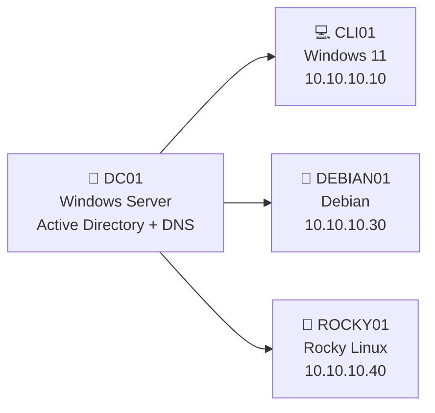
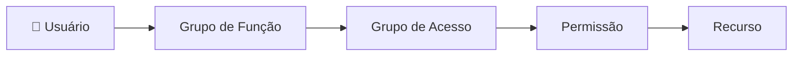
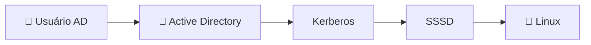
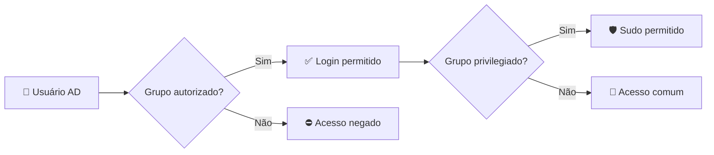
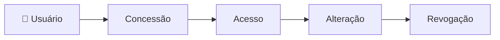
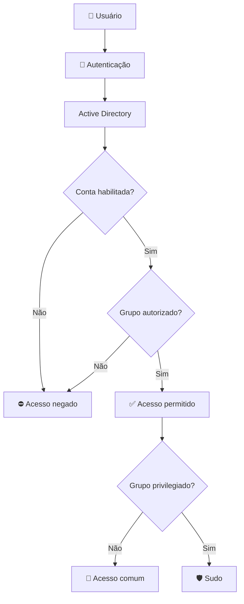

# 🔐 Identity & Access Management Lab

> **Active Directory · Windows · Debian · Rocky Linux · SSSD · Kerberos · GPO**

Laboratório prático de **Gestão de Identidades e Acessos (IAM)** em ambiente multiplataforma, utilizando o **Active Directory** como serviço central de identidade e grupos como principal mecanismo de autorização.

O projeto demonstra autenticação centralizada, controle de acesso baseado em grupos, separação entre usuários comuns e privilegiados, integração Windows/Linux, concessão e revogação de acessos e aplicação do princípio de **Least Privilege**.

---

## 🧭 Ambiente

| Host | Sistema | Papel | IP |
| :--- | :--- | :--- | :--- |
| `DC01` | Windows Server | Active Directory / DNS | `10.10.10.2` |
| `CLI01` | Windows 11 Pro | Estação cliente | `10.10.10.10` |
| `DEBIAN01` | Debian | Servidor Linux | `10.10.10.30` |
| `ROCKY01` | Rocky Linux 9.8 | Servidor Linux | `10.10.10.40` |

**Domínio:** `lab.local` · **Rede:** `10.10.10.0/24` · **DNS:** `10.10.10.2`

### Arquitetura



O `DC01` centraliza as identidades e os serviços do domínio. O `CLI01` representa uma estação corporativa Windows, enquanto `DEBIAN01` e `ROCKY01` representam servidores Linux cujos acessos são controlados através de identidades e grupos.

---

# 🏢 Active Directory

O **Active Directory Domain Services (AD DS)** foi implementado no `DC01` como serviço central de identidade do ambiente.

`DC01` → `AD DS` · `DNS` · `Kerberos` · `lab.local`

### Estrutura

| Componente | Implementação |
| :--- | :--- |
| Domain Controller | `DC01` |
| Domínio / Forest | `lab.local` |
| DNS interno | `10.10.10.2` |
| Organização | Organizational Units (OUs) |
| Identidades | Usuários do domínio |
| Autorização | Grupos de segurança |
| Políticas | Group Policy Objects |
| Autenticação | Kerberos |

<details>
<summary><b>⚙️ Configuração do Domain Controller</b></summary>

<br>

O servidor `DC01` foi configurado com endereço:

```text
10.10.10.2/24
```

e promovido a **Domain Controller** da floresta:

```text
lab.local
```

O serviço DNS foi instalado juntamente com o Active Directory e utilizado pelos demais hosts para localização dos serviços do domínio.

A sincronização de horário também foi configurada e validada entre os sistemas participantes do ambiente.

</details>

---

## Organização de identidades

Os objetos foram organizados em **OUs**, permitindo separar identidades, computadores e aplicação de políticas.

### Usuários e grupos

```text
admin.lab ──────► GG-IT-Admins
                     │
                     └── Perfil privilegiado

user.lab ───────► GG-IT-Users
                     │
                     └── Perfil comum
```

| Identidade | Grupo | Perfil |
| :--- | :--- | :--- |
| `admin.lab` | `GG-IT-Admins` | Privilegiado |
| `user.lab` | `GG-IT-Users` | Comum |

As permissões foram atribuídas preferencialmente aos **grupos**, evitando concessões individuais diretamente às identidades.

---

## Grupos aninhados

Foi utilizado um cenário de **Nested Groups** para separar a função exercida pelo usuário da permissão concedida ao recurso.



Esse modelo permite que uma identidade receba acesso indiretamente através da associação entre grupos.

---

## Group Policy — GPO

A `GPO-IT-Baseline` foi aplicada aos objetos correspondentes para centralizar políticas de segurança no ambiente Windows.

**Controles aplicados**

`Senha` · `Bloqueio de conta` · `Bloqueio por inatividade`

<details>
<summary><b>⚙️ Comandos de aplicação e validação</b></summary>

<br>

```powershell
gpupdate /force
gpresult /r
gpresult /h C:\gpresult.html /f
```

- `gpupdate /force` — força a atualização das políticas.
- `gpresult /r` — exibe as políticas aplicadas.
- `gpresult /h` — gera um relatório detalhado em HTML.

</details>

---

# 💻 Windows Client — CLI01

O `CLI01` representa uma estação corporativa Windows integrada ao domínio.

**Windows 11 Pro** · `10.10.10.10/24` · DNS `10.10.10.2` · `lab.local`

```text
CLI01
  │
  ├── DNS → DC01
  │
  ├── Domínio → lab.local
  │
  ├── Autenticação → Active Directory
  │
  └── Políticas → GPO
```

O ingresso no domínio permite autenticação através das identidades centralizadas e aplicação das políticas definidas no Active Directory.

<details>
<summary><b>🔎 Validação técnica</b></summary>

<br>

```powershell
whoami
ipconfig /all
gpresult /r
```

A aplicação da `GPO-IT-Baseline` foi validada diretamente no `CLI01`.

</details>

---

# 🐧 Linux Servers

Os servidores Debian e Rocky Linux foram utilizados para demonstrar **controle de acesso local** e posteriormente **controle centralizado através do Active Directory**.

Inicialmente, o modelo local utilizado foi:

```text
linuxadmin ──► linux-admins ──► SUDO

linuxuser  ──► linux-users  ──► acesso padrão
```

O privilégio administrativo é atribuído ao **grupo**, e não diretamente à identidade.

---

## Debian — DEBIAN01

**Debian** · `10.10.10.30/24` · DNS `10.10.10.2` · `lab.local`

### Controle de acesso local

`linuxadmin` → `linux-admins` → **sudo permitido**  
`linuxuser` → `linux-users` → **sudo negado**

<details>
<summary><b>⚙️ Rede e validação DNS</b></summary>

<br>

```bash
ip -4 addr
ip route
ping -c 4 10.10.10.2
nslookup lab.local 10.10.10.2
```

O servidor utiliza `10.10.10.2` como DNS interno para resolução do domínio `lab.local`.

</details>

<details>
<summary><b>👥 Criação dos usuários e grupos locais</b></summary>

<br>

**Grupos**

```bash
sudo groupadd linux-admins
sudo groupadd linux-users
```

**Usuários**

```bash
sudo useradd -m -G linux-admins linuxadmin
sudo useradd -m -G linux-users linuxuser
```

**Validação**

```bash
id linuxadmin
id linuxuser
```

</details>

<details>
<summary><b>🛡️ Configuração do sudo</b></summary>

<br>

O grupo administrativo recebeu privilégio através do `sudoers`:

```text
%linux-admins ALL=(ALL:ALL) ALL
```

Resultado:

```text
linuxadmin → linux-admins → sudo permitido
linuxuser  → linux-users  → sudo negado
```

</details>

---

## Rocky Linux — ROCKY01

**Rocky Linux 9.8** · `10.10.10.40/24` · DNS `10.10.10.2` · `lab.local`

### Controle de acesso local

`linuxadmin` → `linux-admins` → **sudo permitido**  
`linuxuser` → `linux-users` → **sudo negado**

<details>
<summary><b>⚙️ Rede e DNS</b></summary>

<br>

A interface interna foi configurada com:

```text
IP:     10.10.10.40/24
DNS:    10.10.10.2
Search: lab.local
```

**Comunicação com o DC**

```bash
ping -c 4 10.10.10.2
```

Resultado:

```text
4 packets transmitted
4 received
0% packet loss
```

**Resolução do domínio**

```bash
nslookup lab.local 10.10.10.2
```

Resultado:

```text
Server:  10.10.10.2
Address: 10.10.10.2#53

Name:    lab.local
Address: 10.10.10.2
```

</details>

<details>
<summary><b>👥 Criação dos usuários e grupos locais</b></summary>

<br>

**Grupos**

```bash
sudo groupadd linux-admins
sudo groupadd linux-users
```

**Usuários**

```bash
sudo useradd -m -G linux-admins linuxadmin
sudo useradd -m -G linux-users linuxuser
```

**Validação**

```bash
id linuxadmin
id linuxuser
```

Estrutura:

```text
linuxadmin
    └── linux-admins

linuxuser
    └── linux-users
```

</details>

<details>
<summary><b>🛡️ Configuração do sudo</b></summary>

<br>

O grupo `linux-admins` recebeu privilégio administrativo:

```text
%linux-admins ALL=(ALL) ALL
```

A diferença de acesso foi validada utilizando os dois perfis:

```text
linuxadmin → operação administrativa permitida
linuxuser  → operação administrativa negada
```

</details>

---

# 🔗 Active Directory + Linux

Os servidores Linux foram integrados ao domínio `lab.local` utilizando **realmd, SSSD e Kerberos**.



### Componentes

| Componente | Papel |
| :--- | :--- |
| Active Directory | Fonte central de identidades e grupos |
| DNS | Localização do domínio e serviços |
| Kerberos | Autenticação |
| `realmd` | Descoberta e ingresso no domínio |
| SSSD | Identidades, grupos e autenticação no Linux |

<details>
<summary><b>⚙️ Ingresso dos servidores no domínio</b></summary>

<br>

**Descoberta**

```bash
realm discover lab.local
```

**Ingresso**

```bash
sudo realm join lab.local -U Administrator
```

**Validação**

```bash
realm list
systemctl status sssd
```

**Consulta de identidade**

```bash
id Administrator@lab.local
```

O retorno da identidade confirma que os servidores Linux conseguem consultar usuários e grupos provenientes do Active Directory.

</details>

---

## Autenticação e autorização

A integração separa duas decisões:

```text
AUTENTICAÇÃO
Quem é o usuário?
        │
        ▼
Active Directory


AUTORIZAÇÃO
O que esse usuário pode acessar?
        │
        ▼
Grupos + políticas
```

O usuário pode possuir uma identidade válida no domínio e, ainda assim, **não possuir autorização para acessar determinado servidor**.

---

## Acesso Linux baseado em grupos do AD

O acesso aos servidores foi controlado através das associações aos grupos do Active Directory.



Isso permite controlar separadamente:

**Identidade** → **Acesso ao servidor** → **Privilégio administrativo**

---

# 🔑 Gestão de Acessos

A associação a grupos foi utilizada como principal mecanismo para administrar o ciclo de vida dos acessos.

### Ciclo de vida



### Concessão

`Usuário` → `Adicionado ao grupo` → `Permissão herdada` → **Acesso concedido**

### Alteração

`Usuário` → `Mudança de grupo` → `Novo nível de privilégio`

### Revogação

`Usuário` → `Removido do grupo` → `Permissão removida` → **Acesso revogado**

### Desativação

`Conta desabilitada no AD` → **Autenticação bloqueada**

---

## Validação dos níveis de acesso

| Cenário | Autenticação | Login Linux | Sudo |
| :--- | :---: | :---: | :---: |
| Usuário comum autorizado | ✅ | ✅ | ❌ |
| Usuário privilegiado | ✅ | ✅ | ✅ |
| Usuário sem grupo autorizado | ✅ | ❌ | — |
| Conta desabilitada | ❌ | ❌ | — |

A diferença entre os perfis é determinada pela **associação aos grupos**, sem necessidade de atribuir permissões diretamente a cada identidade.

---

## Concessão e revogação

O mesmo usuário foi utilizado para demonstrar a alteração dinâmica do acesso:

```text
                 USUÁRIO
                    │
          ┌─────────┴─────────┐
          │                   │
    ADICIONADO            REMOVIDO
     DO GRUPO              DO GRUPO
          │                   │
          ▼                   ▼
       ACESSO              ACESSO
      CONCEDIDO            REVOGADO
```

Essa abordagem simplifica o gerenciamento e reduz permissões individuais espalhadas pelos recursos.

---

## Conta desabilitada

A desativação da identidade no Active Directory interrompe a autenticação nos recursos integrados.

```text
Conta habilitada
      │
      ▼
Autenticação
      │
      ▼
Grupos
      │
      ▼
Autorização


Conta desabilitada
      │
      ▼
Autenticação bloqueada
```

---

# 🛡️ Least Privilege

O modelo de autorização foi estruturado segundo o princípio de **Least Privilege**: cada identidade recebe somente os acessos necessários para exercer sua função.


### Decisões de segurança

| Controle | Implementação |
| :--- | :--- |
| Identidade | Centralizada no Active Directory |
| Autorização | Baseada em grupos |
| Usuário comum | Sem privilégio administrativo |
| Administração | Grupos privilegiados dedicados |
| Linux | Active Directory + SSSD |
| Concessão | Inclusão no grupo |
| Alteração | Mudança de associação |
| Revogação | Remoção do grupo |
| Desativação | Conta desabilitada no AD |
| Windows | Políticas centralizadas via GPO |
| Princípio | Least Privilege |

A utilização de grupos reduz concessões individuais, simplifica auditoria e torna a administração do ciclo de vida dos acessos mais consistente.

---

# 🎬 Evidências

As evidências foram concentradas nas operações relevantes à **Gestão de Identidades e Acessos**, evitando vídeos extensos de instalação de sistemas operacionais ou pacotes.

```text
Active Directory
      │
      ├── OUs
      ├── Usuários
      ├── Grupos
      └── Grupos aninhados
             │
             ▼
       Windows / Linux
             │
      ┌──────┴──────┐
      │             │
 Autenticação   Autorização
      │             │
      └──────┬──────┘
             ▼
       Testes de acesso
```

### Demonstração técnica

O vídeo final apresenta:

- estrutura de OUs, usuários e grupos no Active Directory;
- associações e grupos aninhados;
- aplicação das políticas no Windows;
- reconhecimento das identidades do AD nos servidores Linux;
- autenticação com usuário do domínio;
- usuário autorizado x não autorizado;
- usuário comum x privilegiado;
- `sudo` baseado em grupo;
- concessão de acesso por associação ao grupo;
- revogação por remoção do grupo;
- comportamento de uma conta desabilitada.


---

# 🔎 Fluxo Final de Acesso



O fluxo demonstra a separação entre **identidade, autenticação, autorização e privilégio** utilizada durante todo o laboratório.

---

## Agradecimentos

Agradecimento especial a **Edson Bezerra**  
*Manager, LATAM Cyber Security Infrastructure Services — DXC Technology*

pela mentoria, direcionamento técnico e proposta do laboratório utilizado como base para o desenvolvimento deste projeto.