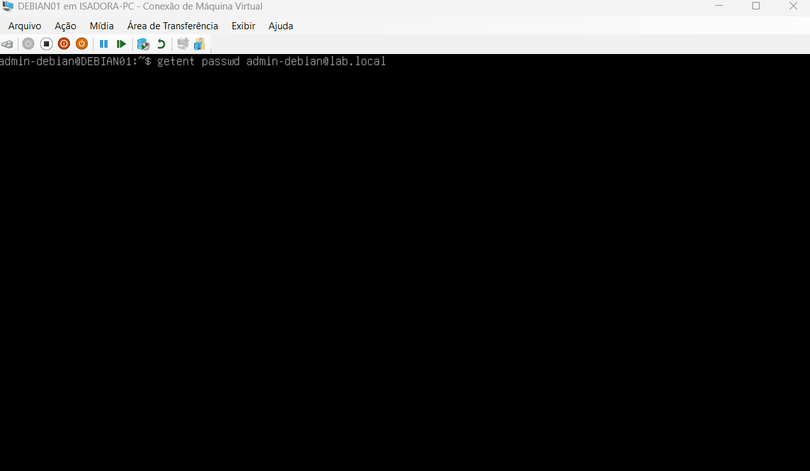
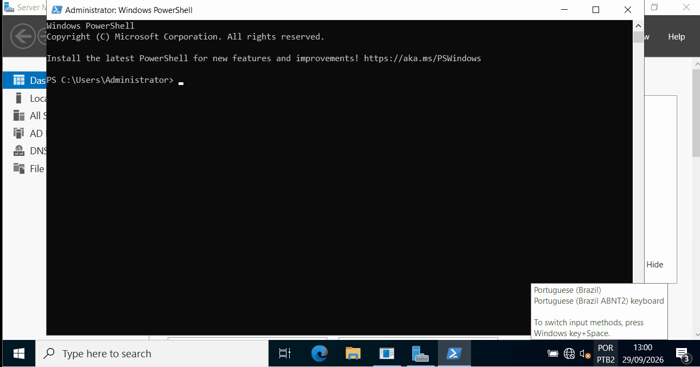

# Lab Prático — Active Directory, GPO e Integração Multiplataforma (Windows & Linux)

## Visão Geral

Este laboratório prático demonstra a construção e validação de uma infraestrutura corporativa integrada, utilizando gerenciamento centralizado de identidades por meio do **Active Directory (Windows Server)**, aplicação de **Group Policies (GPO)**, gerenciamento de permissões locais e integração de servidores Linux (**Ubuntu** e **Rocky Linux**) ao domínio do Active Directory.

O objetivo deste projeto é documentar, de forma clara e sequencial, a implementação e validação dos principais componentes do ambiente, com foco em administração de sistemas, redes, controle de acesso e segurança.

---

## Ambiente do Laboratório

| Host | Sistema Operacional | Função no Ambiente | Endereço IP |
|---|---|---|---|
| **DC01** | Windows Server | Domain Controller / DNS | `10.10.10.2` |
| **CLI01** | Windows 11 Pro | Cliente do domínio | `10.10.10.10` |
| **UBUNTU01** | Ubuntu | Servidor Linux / Cliente AD | `10.10.10.30` |
| **ROCKY01** | Rocky Linux | Servidor Linux / Cliente AD | A definir |

**Domínio:** `lab.local`  
**Rede:** `10.10.10.0/24`  
**Máscara:** `255.255.255.0`  
**DNS interno:** `10.10.10.2`

### Arquitetura da Solução

```text
                         ┌──────────────────────────┐
                         │   DC01 (Windows Server)  │
                         │   Domain Controller/DNS  │
                         │       10.10.10.2         │
                         │        lab.local         │
                         └────────────┬─────────────┘
                                      │
                  ┌───────────────────┼───────────────────┐
                  │                   │                   │
                  ▼                   ▼                   ▼
       ┌──────────────────┐ ┌──────────────────┐ ┌──────────────────┐
       │      CLI01       │ │    UBUNTU01      │ │     ROCKY01      │
       │    Windows 11    │ │      Ubuntu      │ │   Rocky Linux    │
       │   10.10.10.10    │ │   10.10.10.30    │ │    A definir     │
       └──────────────────┘ └──────────────────┘ └──────────────────┘
                                    │                    │
                                    └──── SSSD/realmd ───┘
```

---

## Execução Sequencial do Laboratório

### ETAPA 1: Infraestrutura Windows (Active Directory, Usuários, Grupos e GPO)

#### 1.1. Configuração do Active Directory

- Instalação e provisionamento das funções **AD DS** e **DNS** no servidor `DC01`.
- Promoção do servidor a Controlador de Domínio (DC).
- Criação do domínio `lab.local`.
- Configuração do endereço IPv4.
- Validação da resolução de nomes DNS interna.



*Demonstrando: configuração do Active Directory, DNS e domínio `lab.local`.*

---

#### 1.2. Instalação e Preparação da Estação Cliente (CLI01)

- Criação e alocação de recursos da VM `CLI01` no Hyper-V.
- Instalação do Windows 11 Pro.
- Configuração inicial da estação.
- Configuração do endereço IPv4.
- Configuração do DNS apontando para o Domain Controller.
- Ingresso da estação no domínio `lab.local`.
- Validação da comunicação e autenticação no domínio.


*Demonstrando: preparação da estação Windows 11 e ingresso no domínio `lab.local`.*

---

#### 1.3. Criação de Grupos e Usuários no Active Directory

**Grupos de segurança criados:**

- `GG-IT-Admins` — Administradores de TI
- `GG-IT-Users` — Usuários de TI

**Contas de usuário criadas:**

- `admin.lab` → associado ao grupo `GG-IT-Admins`
- `user.lab` → associado ao grupo `GG-IT-Users`



*Demonstrando: criação das contas, grupos de segurança e associação dos usuários aos respectivos grupos.*

---

#### 1.4. Aplicação e Validação de Políticas de Segurança via GPO

- Criação da `GPO-IT-Baseline`.
- Vinculação da GPO à OU `TI`.
- Configuração de políticas de segurança para computadores e usuários do ambiente:
  - requisitos de senha;
  - bloqueio de conta após tentativas inválidas de autenticação;
  - bloqueio de sessão por inatividade.
- Aplicação e validação das políticas no cliente `CLI01`.

Comandos utilizados para atualização e validação:

```powershell
gpupdate /force
gpresult /r
gpresult /h C:\gpresult.html /f
```


*Demonstrando: configuração da `GPO-IT-Baseline`, aplicação das políticas na estação `CLI01` e validação por meio do `gpresult`.*

---

### ETAPA 2: Servidores Linux (Ubuntu e Rocky Linux — Acessos Locais e Ingresso no AD)

#### 2.1. Configuração do Ubuntu (`UBUNTU01`)

- Configuração de rede do servidor Ubuntu com IP `10.10.10.30/24` e DNS apontando para o Domain Controller (`10.10.10.2`).
- Criação dos grupos locais `linux-admins` e `linux-users`.
- Criação dos usuários `linuxadmin` e `linuxuser` e associação aos respectivos grupos.
- Concessão de privilégios `sudo` ao grupo `linux-admins`.
- Validação da comunicação e resolução DNS com o domínio `lab.local`.
- Instalação e configuração do `realmd` e `SSSD` para integração com o Active Directory.
- Ingresso do servidor no domínio `lab.local` e validação da identidade do usuário do AD.

```bash
realm discover lab.local
realm join lab.local -U admin.lab
id admin.lab@lab.local
```

**Status:** 🚧 Em andamento.

---

#### 2.2. Configuração do Rocky Linux (`ROCKY01`)

- Configuração de rede e DNS apontando para o Domain Controller (`10.10.10.2`).
- Criação dos grupos locais `linux-admins` e `linux-users`.
- Criação dos usuários `linuxadmin` e `linuxuser` e associação aos respectivos grupos.
- Concessão de privilégios `sudo` ao grupo `linux-admins`.
- Instalação e configuração do `realmd` e `SSSD`.
- Ingresso do servidor no domínio `lab.local`.
- Validação do serviço `SSSD` e das identidades do Active Directory.

```bash
realm discover lab.local
realm join lab.local -U admin.lab
systemctl status sssd
```

**Status:** ⏳ Pendente.

---

## Validações e Matriz de Testes

| Item | DC01 | CLI01 | UBUNTU01 | ROCKY01 | Status |
|---|:---:|:---:|:---:|:---:|:---:|
| Configurar Active Directory / DC | ✓ | — | — | — | ✅ Concluído |
| Configurar DNS interno | ✓ | ✓ | — | — | ✅ Concluído |
| Adicionar Windows ao domínio | — | ✓ | — | — | ✅ Concluído |
| Criar usuários e grupos no AD | ✓ | — | — | — | ✅ Concluído |
| Aplicar e validar GPO | — | ✓ | — | — | ✅ Concluído |
| Configurar rede do Ubuntu | — | — | ✓ | — | ✅ Concluído |
| Criar usuários e grupos locais | — | — | 🚧 | ⏳ | 🚧 Em andamento |
| Configurar privilégios `sudo` | — | — | 🚧 | ⏳ | 🚧 Em andamento |
| Validar comunicação Linux → DC01 | — | — | 🚧 | ⏳ | 🚧 Em andamento |
| Integrar Linux ao Active Directory | — | — | ⏳ | ⏳ | ⏳ Pendente |
| Validar autenticação de usuário AD no Linux | — | — | ⏳ | ⏳ | ⏳ Pendente |

---

## Agradecimentos

Agradecimento especial ao **Edson Bezerra** (*Manager, LATAM Cyber Security Infrastructure Services — DXC Technology*) pela mentoria, orientações e incentivo na estruturação deste plano de estudos.